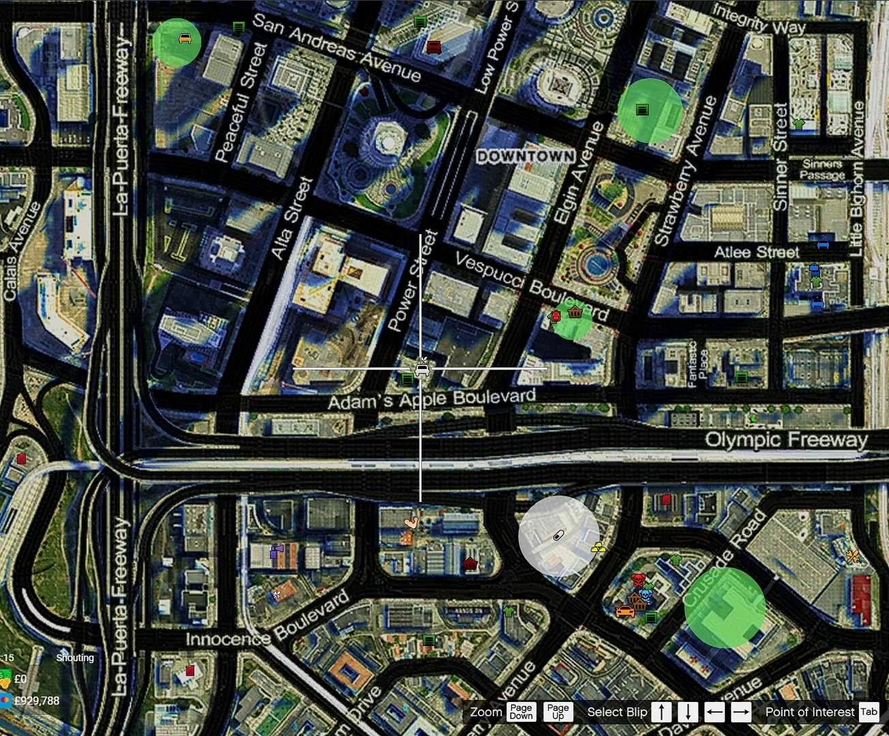

# 🚗 CMG Car Guide

## **There are Five differerent types of Cars within CMG:**

**All cars have variety of storage boots ranging from 30kg to 300kg.**

### Simeons:

First of all we have Simeons where there is a wide variety of bikes/cars and vans. These all have different prices ranging from £2000 to £5,000,000. This also where you can get your whitelisted faction cars for PD, NHS, LFB and HMP.

Simeons can be located by finding the White Car symbol on your map as shown below.

 

### VIP Cars:

These can either be obtained from the [store](https://store.cmgstudios.net/) when purchasing a rank or from other people within CMG the list of shown [here](https://cmgstudios.net/forums/index.php?/imports/vip/). There is all sorts of cars on the link, from sports cars to trucks. If you want to buy or sell one of these cars they can range from £100,000 to £600,000.

### Custom Import Cars:

This is the next level above for the type of vehicles that you can get from CMG, once again there is all types of cars on this [list](https://cmgstudios.net/forums/index.php?/imports/catalogue/) from cars, vans and even aeroplanes or helicopters. The value of these cars to ether buy or sell is all dependant on how much you want to pay/get, but they can range from £1,000,000 to £10,000,000 (maybe even more).

**Slight dislcaimers:**&#x20;

There are vehicles within CMG called "non-cat" cars which means they are custom imports that can't be imported through the catlogue.

Also you do **need** what we call the "VIP" rank from the store (the first rank called "Supporter" will do fine).

### Baller Locked Cars

These are normally the most expensive cars that CMG has to offer and are normally harder to come by as there is normally one 1 or 2 in the whole server. You can get certain cars where there is more than the norm, these cars once they are in they cannot be imported ever again, if you want to see what cars are already in you can check the [locklist](https://docs.google.com/spreadsheets/d/1t3IRfvpqkzACCBRbScHsXrOJ1NTjyOWQuJpg9asVKZ8/edit#gid=0). The prices can range from £5,000,000 all the way to £1,000,000,000 give or take.

If you want to get your own baller locked car you either have to get a custom model made by someone or find the model from somewhere.

### Management/Founder Locked Cars

Finally these are the most expensive cars that hardly ever **** come up for sale and if they expect to pay a good amount of money starting from roughly £350,000,000 to £10,000,000,000. These cars normally have overpowered stats on them ranging from insane speed to a jump and many more.

## Buying/Selling and Renting a Car within CMG

### Buying a Car

As stated above you can either buy one from the store or from another person the way you can buy from another person is straight forward.&#x20;

1. First step is agree with the person the price you want to pay for the car.
2. They will select the car that you agreed on and sell it to you for 'x' amount of Pounds.
3. You will see a message pop up at the bottom of your screen as shown below.
4. Once this message appears you have five seconds to deny uisng **-** or accept the deal using **=**.
5. Finally once you press accept the car will transfer into your garage free to use.

### Selling a Car

This is pretty much the opposite of the guide above.

1. Find the car you want to sell to said person.
2. First step is to enter their Perm ID as shown below
3. Secondly is to enter the amount you agreed on.
4. Once this goes through they will get the message shown above.

 

### Renting a Car

In order to rent a car you will follow the same process explained above to sell a car except you will be asked the amount of hours you would like to rent the vehicle for example if you wanted to rent the car for 3 days then you would input 72 meaning 72 hours. It will then prompt you for the amount of money you want to request for the rental. Finally it will show a rental agreement in the final prompt where you then need to remove all text and input **YES** in order to send the rental agreement to the player.

Once the car has been rented for the 72hours in total it will be automatically returned to your garage as the person who owns the vehicle. Whilst rented the person cannot Sell or Crush the vehicle and there is no danger in renting your vehicles.

## Baller Locks

If you purchase a the Baller rank or a Lockslot from the CMG store you are entitled to make a ticket in the CMG support discord under Baller Ticket from here you will be prompted with your Perm ID obtainable through **/getmyid** and your tbx transaction ID which will be shown to you on the successful transaction splash screen.

You will need to provide Donation support in your ticket with a valid car model that can be imported into CMG, this can be obtainable through 3rd party sites such as [GTA5Mods](https://www.gta5-mods.com/) or through private discords.\
\
You will also need to make sure that the Model you are currently looking to import isn't already imported by another player. You can do so by checking the [CMG Locklist](https://docs.google.com/spreadsheets/d/1t3IRfvpqkzACCBRbScHsXrOJ1NTjyOWQuJpg9asVKZ8/)


