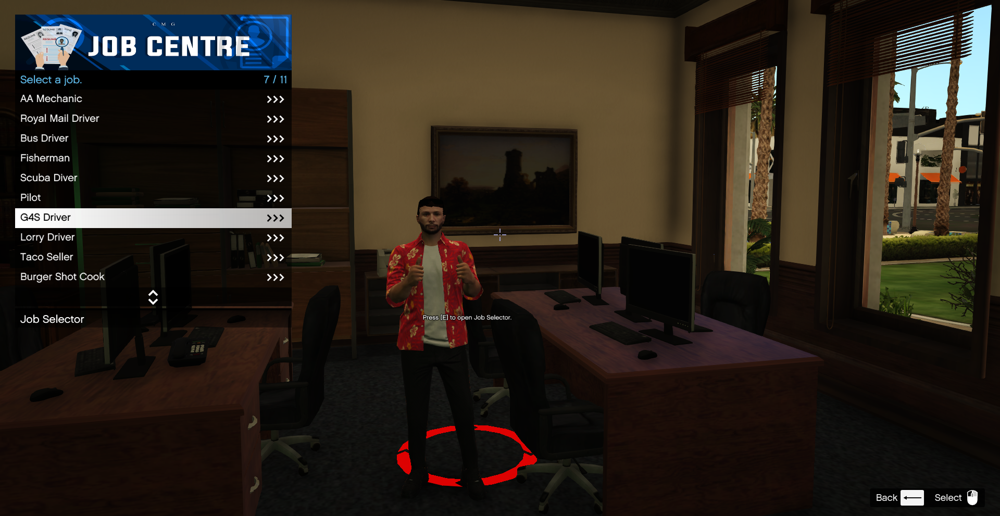

# 🖐 New Player Guide

When you first join the city you will have to complete a tutorial post completing the tutorial you should be at **City Hall**.

.png>)

An image below shows the location of **City Hall** on the GPS in case you have deviated away from this area upon completion of the tutorial.

.png>)

In here there is a multitude of things for you to do in order for you to start off your journey within CMG.

As you walk into **City Hall** there is a desk directly adjacent to the door which you can use to change your identity and you will be prompted for the following.

* First Name
* Last Name
* Age

.png>)

Once you have managed to successfully change your information when someone asks for your ID they will be able to see the information you inputted. See an image below.

.png>)

## Jobs

If you turn left once entering the **City Hall** your first door on your right through the corridor will lead you to the **Job Centre** where there is plenty of jobs for you to start off doing in order to gain some extra cash.

Refer to the Jobs Guide below


[cmg-jobs](cmg-jobs/)


## License Plate & Phone numbers

In the furthest room down the corridor there is a room where you can get custom number plates and phone numbers I will show a quick demonstration on how you would go about getting yourself a custom number plate or phone number.

Firstly I would check if your desired number plate or phone number is available for purchase by hitting enter on **Check Plate Availability** and typing in your desired plate like the image below.

.png>)

Now that you have confirmation that the plate is available you need to then purchase a phone or number plate token from the [CMG Store](https://store.cmgstudios.net/) under the **Other** tab.


Phone numbers are not sellable unlike license plates and will be your phone number permanently so choose wisely! :smile:


Once a token has been purchased wait 5-10 minutes for the token to be applied to your account.


**Tip**   You can always double check what item tokens you currently have by pressing **F2** and then **Item Tokens**


Once you have confirmed your token has been applied to your account click **Redeem License plate** and type in your desired plate and hit **Enter**

To apply your newly purchased license plate go to **Owned License plates -> Available plates** where you should see your newly purchased license plate. See an image below.

.png>)

You can now hit **Enter** then go to **Apply on Vehicle** which should show you a list of vehicles in your garage hit **Enter** on your desired vehicle and you have transferred the plate! :smile:
